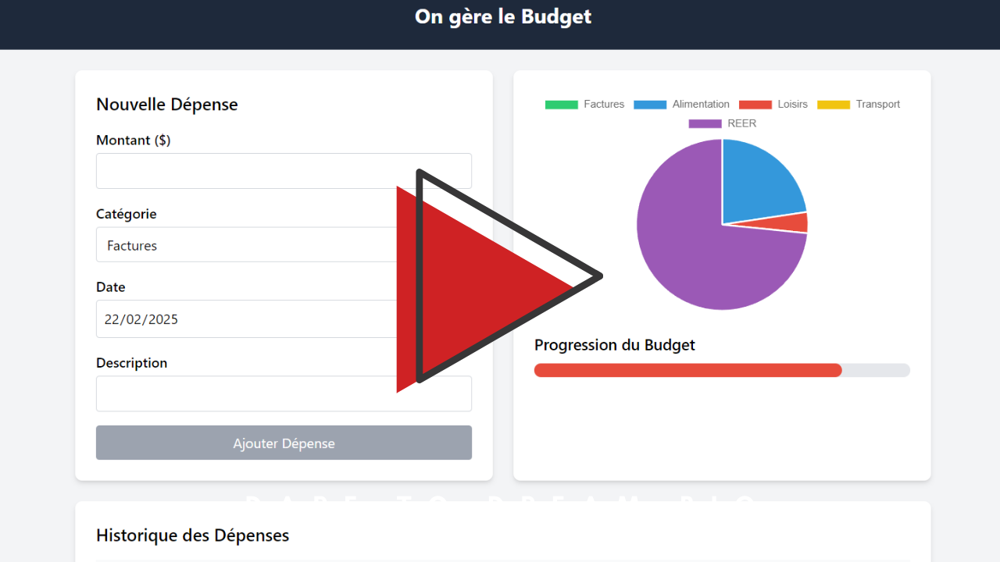

# Gestionnaire de Budget

## Description
Le Gestionnaire de Budget est une application de bureau développée avec Electron qui permet aux utilisateurs de suivre leurs dépenses, de gérer des catégories de dépenses et de visualiser des graphiques de répartition des dépenses. L'application offre également des fonctionnalités pour alerter les utilisateurs lorsqu'ils approchent ou dépassent leur budget.

## Fonctionnalités
- Ajouter, modifier et supprimer des dépenses
- Gérer des catégories de dépenses
- Visualiser des graphiques de répartition des dépenses
- Suivi du budget avec des alertes en cas de dépassement
- Historique des dépenses
- Gestion des catégories supprimées

## Installation
1. Clonez le dépôt :
    ```sh
    git clone git@github.com:lkbinks91/App-Desktop-Electron.git
    ```
2. Accédez au répertoire du projet :
    ```sh
    cd electron-projet-pt3
    ```
3. Installez les dépendances :
    ```sh
    npm install
    ```

## Utilisation
Pour démarrer l'application, exécutez la commande suivante :
```sh
npm start

Technologies Utilisées
Electron
Chart.js
Tailwind CSS

Licence
Ce projet est sous licence MIT. Voir le fichier LICENSE pour plus de détails.

## Demo video

[](https://youtu.be/D2e4_G-rhlA)


